# 🚀 a-simple-t2s-flow (E-Commerce Data Warehouse Pipeline)

> **Modern End-to-End Data Pipeline**: Extracting e-commerce transaction data from **SQL Server OLTP** via **DLT (Data Load Tool)**, storing & transforming data in **DuckDB Warehouse** with **dbt (Bronze → Silver → Gold Medallion Architecture)**, and orchestrating workflow DAGs with **Astronomer Cosmos (Apache Airflow)**.

---

## 📐 System Architecture

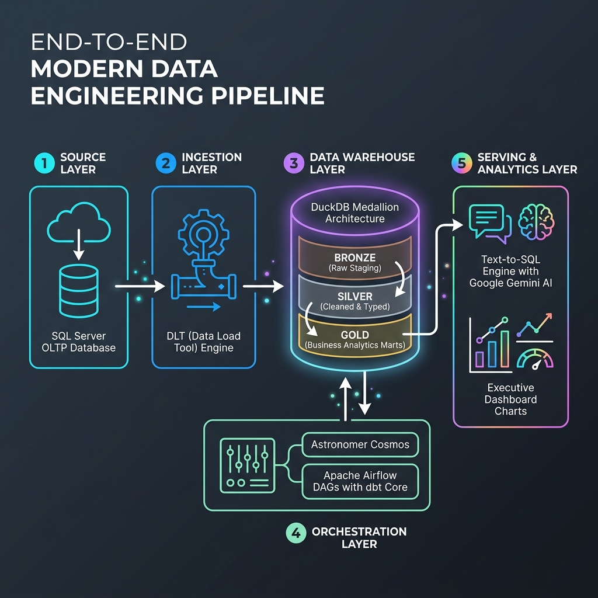

> 🎨 *Overall Modern Data Stack Architecture diagram designed for End-to-End E-Commerce Data Processing.*

### 🔄 Data Flow Pipeline

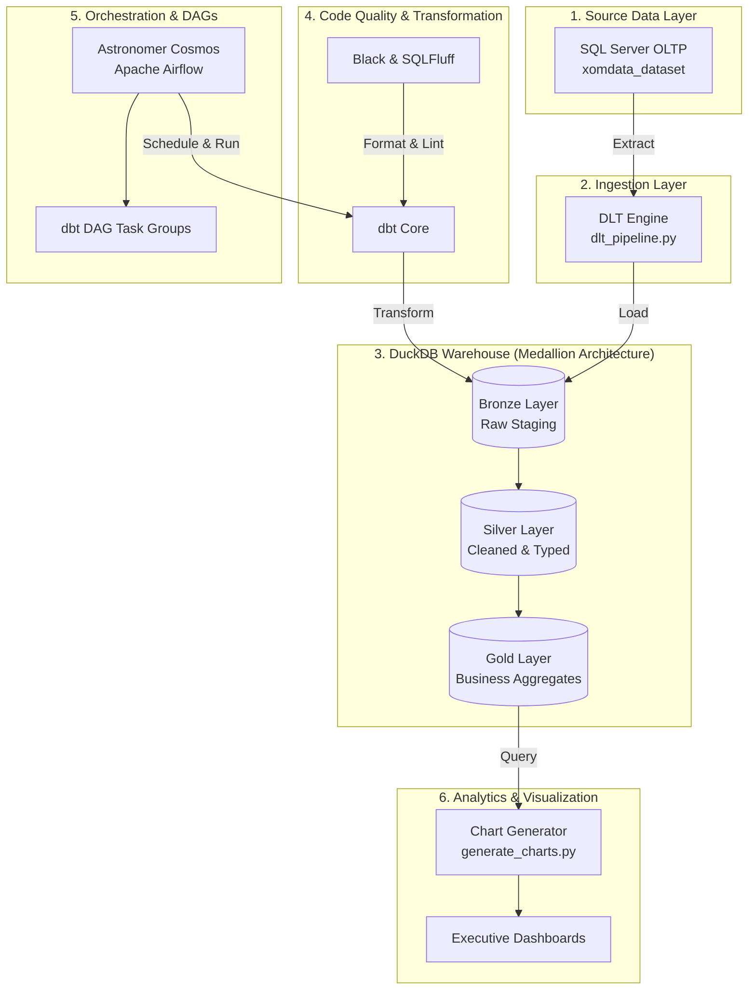

### 🧱 Architectural Components Breakdown

| Layer | Technology / Tool | Primary Responsibility |
| :--- | :--- | :--- |
| **1. Source Data** | SQL Server OLTP | Hosts transactional e-commerce data across 4 core tables: `customer`, `ecom_sales`, `product`, `region`. |
| **2. Ingestion** | DLT (Data Load Tool) | Automated extraction & loading from SQL Server to DuckDB with schema inference and verification. |
| **3. Data Warehouse** | DuckDB (`warehouse.duckdb`) | Compact, high-performance OLAP database engine storing the Medallion Architecture (Bronze/Silver/Gold). |
| **4. Data Transformation** | dbt (data build tool) | Multi-layered data model transformations: **Bronze** (Raw) ➔ **Silver** (Cleaned & Typed) ➔ **Gold** (Business KPIs: RFM, YoY Revenue, Top Products, Churn Risk). |
| **5. Code Quality** | Black & SQLFluff | Code formatting for Python (`black`) and SQL linting for dbt models (`sqlfluff` with duckdb dialect). |
| **6. Orchestration & Workflow** | Astronomer Cosmos (Airflow) | Orchestrates dbt models natively inside Apache Airflow as modular DAG task groups with workflow dependency management. |
| **7. Analytics Output** | Python (Matplotlib/Seaborn) | Automatically queries Gold models and generates executive dashboards saved in `docs/chart_generation/charts/`. |
| **8. Text-to-SQL Engine** | Python + Google Gemini + DuckDB | Translates natural language questions into validated DuckDB SQL queries and returns formatted results. |

---

## 📁 Directory Structure

```text
a-simple-t2s-flow/
├── ingestion/                     # 📥 Data ingestion pipeline scripts
│   ├── __init__.py
│   └── dlt_pipeline.py            # DLT extraction script from SQL Server to DuckDB
│
├── orchestration/                 # ⚙️ Pipeline orchestration & workflow DAGs
│   ├── __init__.py
│   ├── orchestrator.py            # Main ETL workflow coordinator script
│   └── cosmos_orchestrator.py     # Astronomer Cosmos Airflow DAG integration
│
├── text2sql/                      # 🤖 Text-to-SQL (T2S) Natural Language Query Engine
│   ├── __init__.py
│   ├── schema.py                  # DDL Schema Introspector for LLM Context
│   ├── generator.py               # Gemini LLM & Fallback Rule-based SQL Generator
│   ├── executor.py                # Safe DuckDB SQL Execution Engine
│   └── cli.py                     # Rich Interactive Terminal CLI Shell
│
├── dbt_model/                     # 🗄️ All dbt models & transformation assets
│   ├── models/                    # Bronze, Silver, and Gold SQL models
│   ├── macros/                    # Custom dbt Jinja macros
│   ├── seeds/                     # Reference seed datasets
│   ├── tests/                     # dbt Data assertions and tests
│   ├── profiles.yml               # DuckDB connection profile
│   └── dbt_project.yml            # dbt project configuration
│
├── duckdb_warehouse/              # 💾 DuckDB Database storage directory
│   └── warehouse.duckdb
│
└── docs/                          # 🎨 Documentation & visual assets
    ├── excalidraw/                # Architecture diagrams (.png, .excalidraw, .svg)
    └── chart_generation/          # Chart generation script & images (`generate_charts.py`, `charts/`)
```

---

## 🚀 Quick Start Guide (How to Run the Project)

Follow these step-by-step instructions to set up, execute, and validate the pipeline.

### Step 1: Prerequisites & Environment Setup

1. **Clone Repository & Navigate to Workspace**:
   ```bash
   cd a-simple-t2s-flow
   ```

2. **Configure Environment Variables**:
   ```bash
   cp .env.example .env
   ```
   *(Verify your SQL Server OLTP connection credentials inside `.env`)*

3. **Activate Virtual Environment & Install Dependencies**:
   ```bash
   source .venv/bin/activate
   pip install -r requirements.txt
   ```

4. **Configure PATH Environment (Optional)**:
   ```bash
   export PATH="$PWD/.venv/bin:$PATH"
   ```

---

### Step 2: Running the Pipeline

Choose one of the 3 flexible methods to execute the data pipeline:

#### 🟢 Option A: One-Command Execution (Recommended via Makefile)
Run the entire pipeline end-to-end (Ingestion ➔ dbt Transformation ➔ Analytics Charts):
```bash
make run-all
```

#### 🟡 Option B: Step-by-Step Manual Execution

1. **Ingest Raw Data (SQL Server ➔ DuckDB)**:
   ```bash
   python ingestion/dlt_pipeline.py
   # OR: make ingest
   ```

2. **Transform Data Warehouse Models (Bronze ➔ Silver ➔ Gold)**:
   ```bash
   dbt run --project-dir dbt_model --profiles-dir dbt_model
   # OR: make dbt-run
   ```

3. **Validate Data Quality & Assertions**:
   ```bash
   dbt test --project-dir dbt_model --profiles-dir dbt_model
   # OR: make dbt-test
   ```

4. **Generate Executive Analytics Dashboards**:
   ```bash
   python docs/chart_generation/generate_charts.py
   # OR: make charts
   ```

#### 🟣 Option C: Coordinated Workflow Orchestration
Run the pipeline via the orchestration engine:
```bash
python orchestration/orchestrator.py
# OR: make orchestrate
```

---

### Step 3: Code Formatting & Quality Control

Ensure code quality standards before committing code:

```bash
# Format Python scripts with Black:
make format

# Lint dbt SQL models with SQLFluff:
make lint

# Auto-fix SQL formatting errors:
make lint-fix

# Run both Python and SQL checks:
make check-all
```

---

## 🛠️ Makefile Commands Reference

| Command | Description |
| :--- | :--- |
| `make help` | Display all available Makefile commands |
| `make install` | Install Python packages from `requirements.txt` |
| `make ingest` | Run DLT data extraction & ingestion |
| `make dbt-run` | Run dbt models (Bronze, Silver, Gold) |
| `make dbt-test` | Run dbt data quality test suite |
| `make dbt-clean` | Clean compiled dbt target artifacts |
| `make orchestrate` | Run full ETL orchestrator workflow |
| `make charts` | Generate Gold analytics dashboard images |
| `make format` | Format Python code using `black` |
| `make lint` | Lint SQL models using `sqlfluff` |
| `make lint-fix` | Auto-fix SQL formatting using `sqlfluff` |
| `make check-all` | Verify Python formatting and SQL linting |
| `make run-all` | Run entire pipeline end-to-end (`ingest` ➔ `dbt-run` ➔ `charts`) |

---

## ⚡ Pipeline Execution Commands (CLI)

### 1. Extract & Load Raw Data (DLT Ingestion)
```bash
python ingestion/dlt_pipeline.py
```

### 2. Run End-to-End Orchestration (ETL + Audit Log)
```bash
python orchestration/orchestrator.py
```

### 3. Transform Data Warehouse Models (dbt Run)
```bash
# Run from within dbt_model folder:
cd dbt_model && dbt run

# Or run directly from project root:
dbt run --project-dir dbt_model --profiles-dir dbt_model
```

### 4. Generate Business Analytics Dashboards (Gold Charts)
```bash
python docs/chart_generation/generate_charts.py
```

### 5. Format & Lint Codebase (Black & SQLFluff)

**Option A: Running from Project Root (`a-simple-t2s-flow/`)**
```bash
# Format Python scripts
black ingestion/ orchestration/ docs/chart_generation/

# Lint & Fix dbt SQL models
sqlfluff lint dbt_model/models --dialect duckdb
sqlfluff fix dbt_model/models --dialect duckdb
```

**Option B: Running from within `dbt_model/` Directory**
```bash
# Lint & Fix dbt SQL models
sqlfluff lint models --dialect duckdb
sqlfluff fix models --dialect duckdb

# Format Python scripts (return to root)
cd .. && black ingestion/ orchestration/ docs/chart_generation/ && cd dbt_model
```

---

## 💻 Actual Execution Output Logs

### 🟢 Orchestrator Execution Log (`python orchestration/orchestrator.py`)
```text
[Cosmos DB] Skipping cloud metadata sync (credentials not set). Local run logged: success
Orchestration complete: {
    'id': 'xom_ecom_run_20260724T180654Z',
    'pipeline_id': 'xom_ecom_run_20260724T180654Z',
    'status': 'success',
    'timestamp': '2026-07-24T18:07:06.292896+00:00',
    'details': {'pipeline_name': 'xom_ecom_warehouse'}
}
```

### 🟢 dbt Transformation Log (`dbt run --project-dir dbt_model --profiles-dir dbt_model`)
```text
18:47:24  Running with dbt=1.12.0
18:47:32  Registered adapter: duckdb=1.10.1
18:47:27  Found 23 models, 4 sources, 493 macros

18:47:27  1 of 23 START sql table model main.bronze_customer ............................. [RUN]
18:47:27  1 of 23 OK created sql table model main.bronze_customer ........................ [OK in 0.23s]
18:47:27  2 of 23 START sql table model main.bronze_ecom_sales ........................... [RUN]
...
18:47:31  23 of 23 START sql table model main.vip_churn_risk ............................. [RUN]
18:47:31  23 of 23 OK created sql table model main.vip_churn_risk ........................ [OK in 0.09s]

18:47:31  Finished running 23 table models in 0 hours 0 minutes and 4.47 seconds (4.47s).
18:47:31  Completed successfully
18:47:31  Done. PASS=23 WARN=0 ERROR=0 SKIP=0 NO-OP=0 REUSED=0 TOTAL=23
```

---

## 📊 Business Analytics Query Results (Real Data Output)

Extracted directly from the DuckDB Data Warehouse (`duckdb_warehouse/warehouse.duckdb`):

### 1. Total Revenue & Profit (`total_revenue_profit`)
| Total Revenue ($) | Total Profit ($) |
|------------------:|----------------:|
|      $6,517,674.00 |   $1,065,413.58 |

### 2. Revenue & Profit by Customer Segment (`revenue_by_segment`)
| Customer Segment | Revenue ($) | Profit ($) |
|:-----------------|------------:|-----------:|
| Corporate        | $3,840,707.00 | $608,523.36 |
| Consumer         | $2,146,780.00 | $365,377.50 |
| Self-Employed    |   $530,187.00 |  $91,512.72 |

### 3. Profit Margin by Market (`profit_margin_by_market`)
| Market | Profit Margin (%) |
|:-------|------------------:|
| Europe | 22.30% |
| USCA | 16.24% |
| LATAM | 16.13% |
| Africa | 13.60% |
| Asia Pacific | 12.48% |

### 4. Top 5 Best-Selling Products (`top_10_products`)
| Product ID | Product Name | Order Count | Revenue ($) | Profit ($) |
|:-----------|:-------------|------------:|------------:|-----------:|
| P000116 | Herbal Essences Bio | 335 | $67,640.00 | $9,089.67 |
| P000619 | Neutrogena Hydro Boost Gel Cream | 227 | $15,535.00 | $2,994.13 |
| P000473 | Essie Nail Polish Aruba Blue Shimmering Cobalt | 92 | $4,140.00 | $765.70 |
| P000512 | Head & Shoulders Classic Clean Conditioner | 90 | $16,058.00 | $2,960.81 |
| P000114 | Redken Color Extend Magnetics Conditioner | 84 | $2,380.00 | $396.42 |

---

## 📉 Executive Dashboards & Gold Visualizations

Charts are generated automatically from live Gold tables in DuckDB via `python docs/chart_generation/generate_charts.py`:

| Analytics Chart | Visual Preview |
|:----------------|:---------------|
| **1. Overall Business KPIs** | 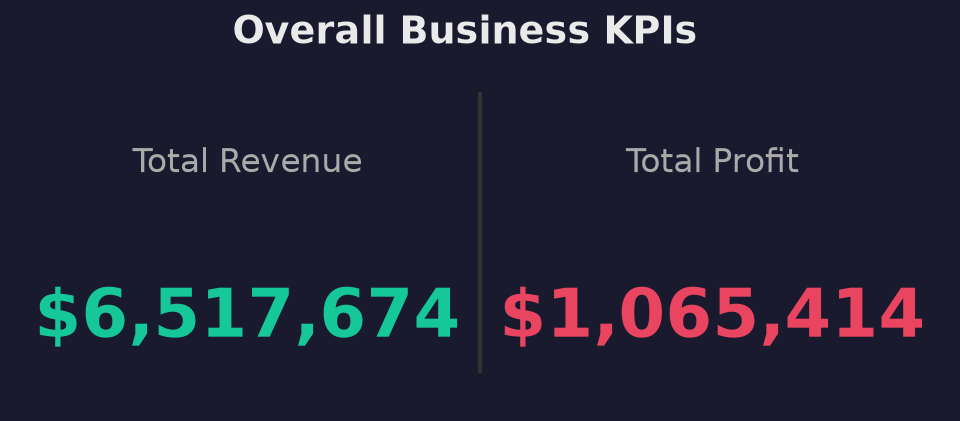 |
| **2. Revenue & Profit by Segment** | 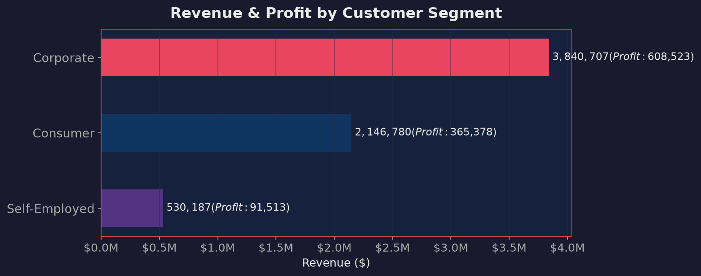 |
| **3. Profit Margin by Market** | 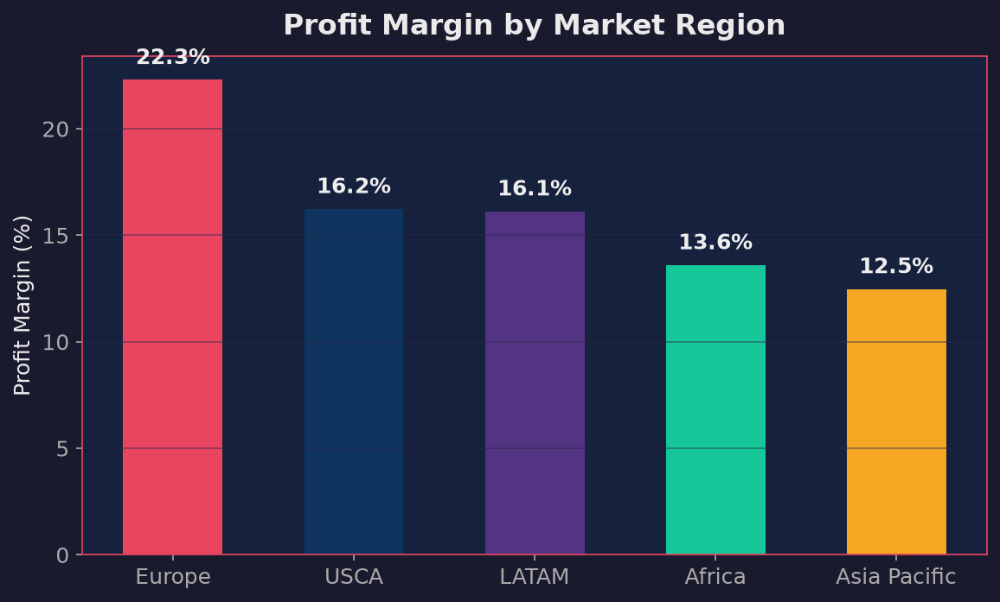 |
| **4. Top 10 Best-Selling Products** | 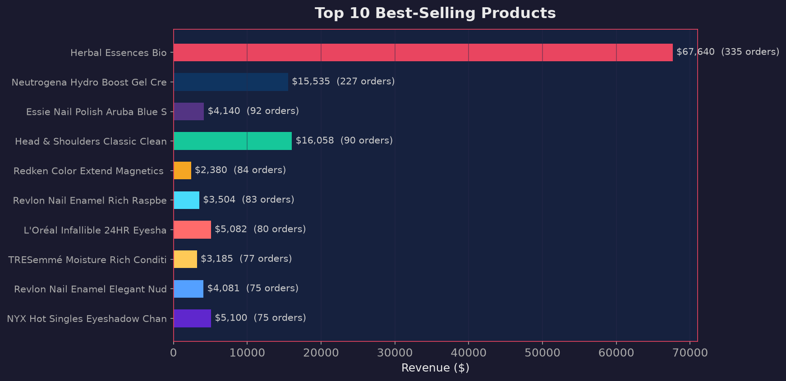 |
| **5. Top 15 Countries by Revenue** | 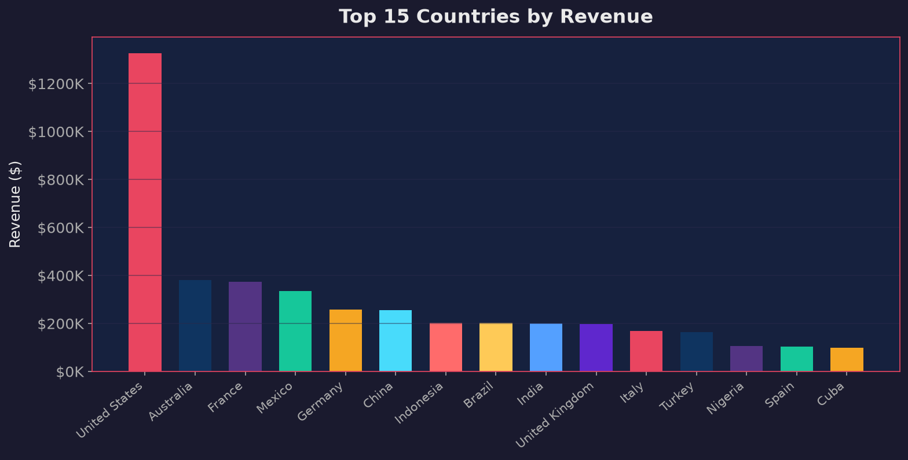 |
| **6. Monthly Revenue Trend & MoM %** | 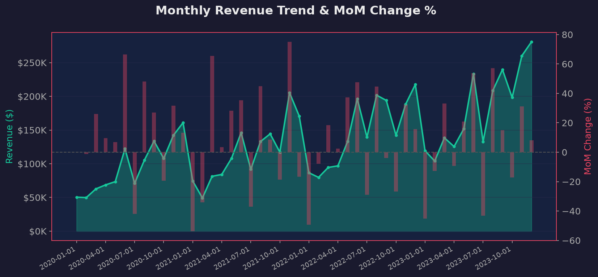 |
| **7. Avg Discount Rate by Category** | 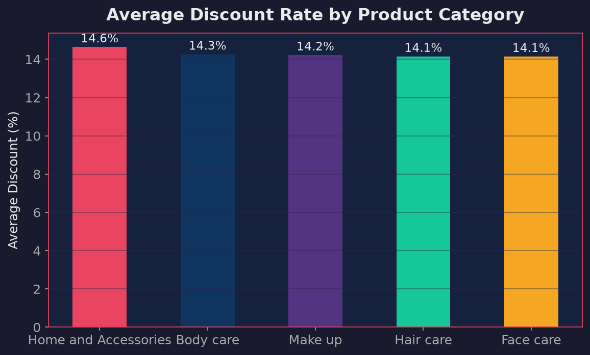 |
| **8. Customer RFM Segments** | 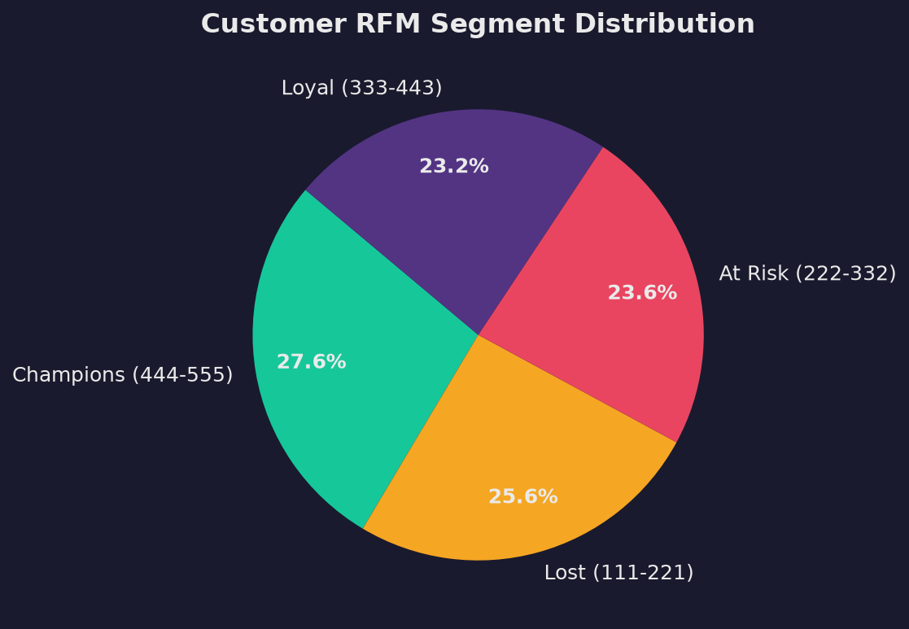 |
| **9. Loss Orders Distribution** | 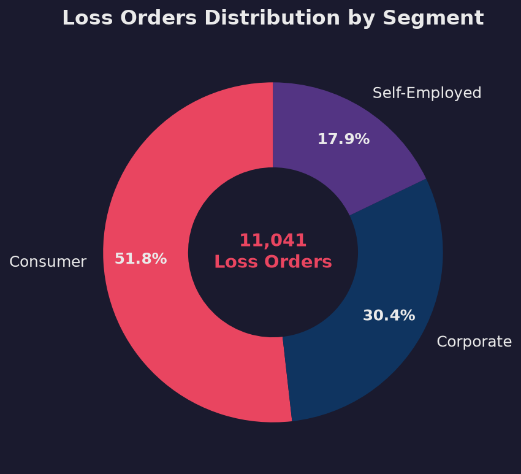 |
| **10. Gender & Occupation Distribution** | 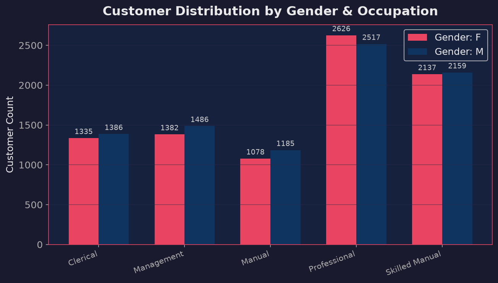 |
