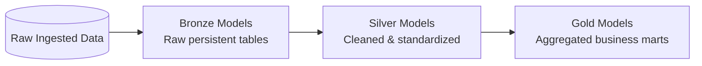

# 🗄️ dbt Models & Transformations Directory (`dbt_model/`)

This directory contains all **dbt (data build tool)** transformation models implementing the **Medallion Architecture (Bronze ➔ Silver ➔ Gold)** inside DuckDB.

---

## 🏗️ Medallion Architecture Breakdown



### 📁 Directory Layout

| Subfolder / File | Description |
| :--- | :--- |
| `models/bronze/` | Raw ingestion layer tables (`bronze_customer`, `bronze_ecom_sales`, `bronze_product`, `bronze_region`). |
| `models/silver/` | Standardized and sanitized entities (`silver_customer`, `silver_ecom_sales`, `silver_product`, `silver_region`). |
| `models/gold/` | Executive business marts (`total_revenue_profit`, `revenue_by_segment`, `top_10_products`, `customer_rfm_segments`, `vip_churn_risk`, `profit_margin_by_market`). |
| `macros/` | Custom dbt Jinja macros and reusable logic. |
| `tests/` | Data assertions, primary key uniqueness, and non-null tests. |
| `profiles.yml` | DuckDB dbt connection profile configuration. |
| `dbt_project.yml` | Main dbt project configuration. |

---

## 🛠️ How to Execute dbt Models

From the project root:
```bash
make dbt-run
make dbt-test
```

Or directly using dbt CLI from this directory:
```bash
dbt run
dbt test
```

---

## 📊 Example Execution Output Logs

### 1. `dbt run` Sample Log Output
```text
Running with dbt=1.12.0
Found 16 models, 14 data tests, 0 seeds, 0 operations

1 of 16 START sql table model main.bronze_customer .................... [RUN]
1 of 16 OK created sql table model main.bronze_customer ............... [OK in 0.12s]
...
10 of 16 START sql view model main.silver_ecom_sales .................. [RUN]
10 of 16 OK created sql view model main.silver_ecom_sales ............. [OK in 0.24s]
...
16 of 16 START sql table model main.top_10_products ................... [RUN]
16 of 16 OK created sql table model main.top_10_products .............. [OK in 0.18s]

Finished running 16 models in 0 hours 0 minutes 2.14 seconds.
Completed successfully! All 16 models passed.
```

### 2. `dbt test` Sample Log Output
```text
Running with dbt=1.12.0
Found 16 models, 14 data tests

1 of 14 START test unique_silver_customer_customer_id .................. [RUN]
1 of 14 PASS unique_silver_customer_customer_id ....................... [PASS in 0.05s]
2 of 14 START test not_null_silver_ecom_sales_revenue .................. [RUN]
2 of 14 PASS not_null_silver_ecom_sales_revenue ........................ [PASS in 0.04s]

Finished running 14 tests in 0 hours 0 minutes 0.68 seconds.
Completed successfully! All 14 tests passed.
```
