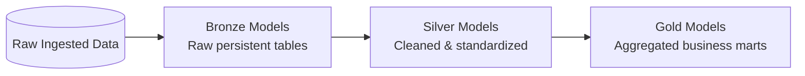

# 🗄️ dbt Models & Transformations Directory (`dbt_model/`)

This directory contains all **dbt (data build tool)** transformation models implementing the **Medallion Architecture (Bronze ➔ Silver ➔ Gold)** inside DuckDB.

---

## 🏗️ Medallion Architecture Breakdown



### 📁 Directory Layout

| Subfolder / File | Description |
| :--- | :--- |
| `models/bronze/` | Raw ingestion layer tables (`bronze_customer`, `bronze_ecom_sales`, `bronze_product`, `bronze_region`). |
| `models/silver/` | Standardized and sanitized entities (`silver_customer`, `silver_ecom_sales`, `silver_product`, `silver_region`). |
| `models/gold/` | Executive business marts (`total_revenue_profit`, `revenue_by_segment`, `top_10_products`, `customer_rfm_segments`, `vip_churn_risk`, `profit_margin_by_market`). |
| `macros/` | Custom dbt Jinja macros and reusable logic. |
| `tests/` | Data assertions, primary key uniqueness, and non-null tests. |
| `profiles.yml` | DuckDB dbt connection profile configuration. |
| `dbt_project.yml` | Main dbt project configuration. |

---

## 🛠️ How to Execute dbt Models

From the project root:
```bash
make dbt-run
make dbt-test
```

Or directly using dbt CLI from this directory:
```bash
dbt run
dbt test
```
