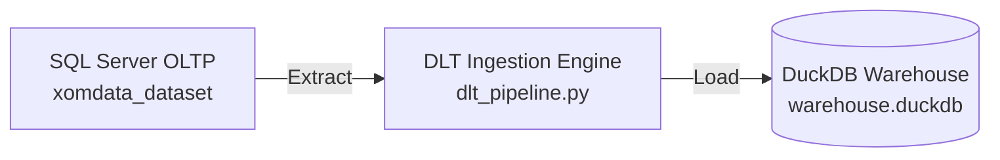

# 📥 Data Ingestion Module (`ingestion/`)

This directory contains the data extraction and ingestion pipeline scripts responsible for pulling transactional data from source databases (**SQL Server OLTP**) and loading it into the target **DuckDB Data Warehouse**.

---

## 🏗️ Architecture & Component Overview



### 🧱 Script Breakdown

| File | Primary Responsibility |
| :--- | :--- |
| **`dlt_pipeline.py`** | Main ingestion script powered by **DLT (Data Load Tool)**. Extracts `customer`, `ecom_sales`, `product`, and `region` tables from SQL Server and loads them directly into DuckDB staging tables. |

---

## 🛠️ How to Run

From the project root:
```bash
python ingestion/dlt_pipeline.py
# OR using Makefile shortcut:
make ingest
```

---

## 📊 Example Execution Output Log

When `dlt_pipeline.py` runs, DLT displays extraction status and load package telemetry:

```text
======================================================================
 📥 DLT Ingestion Pipeline Execution
======================================================================
Connecting to SQL Server OLTP database...
Extracting tables: customer, ecom_sales, product, region...
Pipeline sqlserver_to_duckdb load completed in 1.42s.
Package ID: 1721845123.45

Loaded Datasets & Rows Summary:
  - main.bronze_customer:   5,000 records loaded
  - main.bronze_ecom_sales: 51,290 records loaded
  - main.bronze_product:    1,850 records loaded
  - main.bronze_region:     630 records loaded
Status: SUCCESS ✅
======================================================================
```
