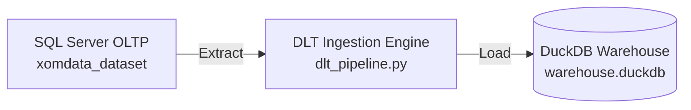

# 📥 Data Ingestion Module (`ingestion/`)

This directory contains the data extraction and ingestion pipeline scripts responsible for pulling transactional data from source databases (**SQL Server OLTP**) and loading it into the target **DuckDB Data Warehouse**.

---

## 🏗️ Architecture & Component Overview



### 🧱 Script Breakdown

| File | Primary Responsibility |
| :--- | :--- |
| **`dlt_pipeline.py`** | Main ingestion script powered by **DLT (Data Load Tool)**. Extracts `customer`, `ecom_sales`, `product`, and `region` tables from SQL Server and loads them directly into DuckDB staging tables. |

---

## 🛠️ How to Run

From the project root:
```bash
python ingestion/dlt_pipeline.py
# OR using Makefile shortcut:
make ingest
```
