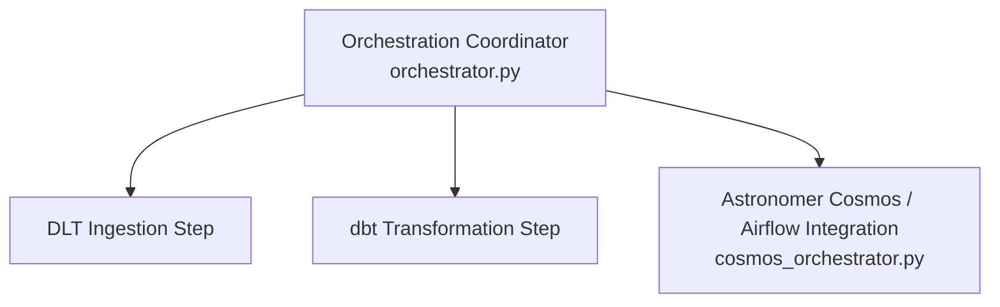

# ⚙️ Pipeline Orchestration Module (`orchestration/`)

This directory manages end-to-end workflow execution, scheduling, task coordination, and execution telemetry monitoring across the pipeline.

---

## 🏗️ Architecture & Component Overview



### 🧱 Script Breakdown

| File | Primary Responsibility |
| :--- | :--- |
| **`orchestrator.py`** | Main ETL orchestrator script coordinating data ingestion, dbt transformations, and logging run status. |
| **`cosmos_orchestrator.py`** | Integration module for **Astronomer Cosmos (Apache Airflow)** to run dbt models natively inside Airflow DAG task groups. |

---

## 🛠️ How to Run

From the project root:
```bash
python orchestration/orchestrator.py
# OR using Makefile shortcut:
make orchestrate
```
