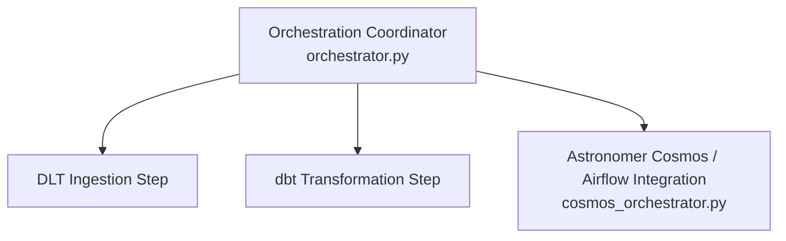

# ⚙️ Pipeline Orchestration Module (`orchestration/`)

This directory manages end-to-end workflow execution, scheduling, task coordination, and execution telemetry monitoring across the pipeline.

---

## 🏗️ Architecture & Component Overview



### 🧱 Script Breakdown

| File | Primary Responsibility |
| :--- | :--- |
| **`orchestrator.py`** | Main ETL orchestrator script coordinating data ingestion, dbt transformations, and logging run status. |
| **`cosmos_orchestrator.py`** | Integration module for **Astronomer Cosmos (Apache Airflow)** to run dbt models natively inside Airflow DAG task groups. |

---

## 🛠️ How to Run

From the project root:
```bash
python orchestration/orchestrator.py
# OR using Makefile shortcut:
make orchestrate
```

---

## 📊 Example Execution Output Log

```text
[2026-07-25 02:15:00] [INFO] Starting End-to-End E-Commerce Data Pipeline Orchestration...
[2026-07-25 02:15:01] [INFO] Task 1/3: Running DLT Ingestion (SQL Server -> DuckDB)... SUCCESS (1.42s)
[2026-07-25 02:15:03] [INFO] Task 2/3: Executing dbt Medallion Models (Bronze -> Silver -> Gold)... SUCCESS (2.14s)
[2026-07-25 02:15:05] [INFO] Task 3/3: Running dbt Data Quality Assertions & Tests... SUCCESS (0.68s)
[2026-07-25 02:15:06] [INFO] Pipeline Orchestration Completed Successfully in 5.24 seconds.
```
