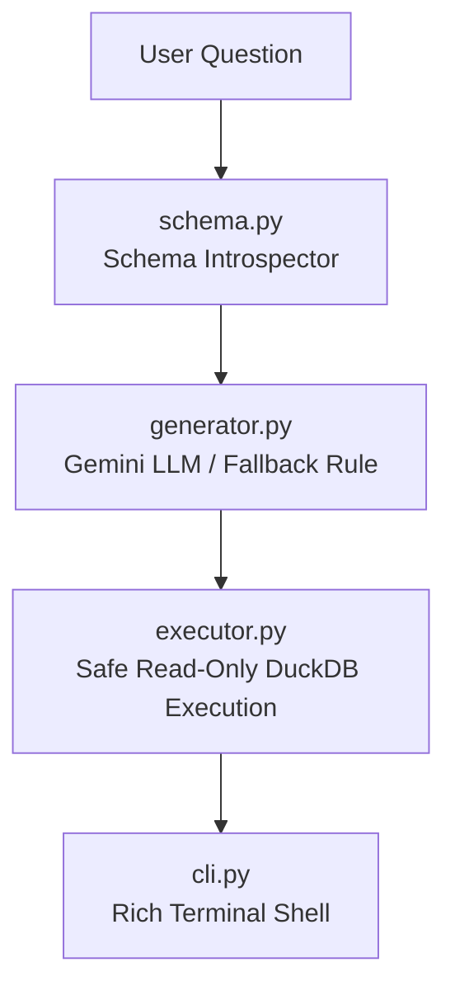

# 🤖 Text-to-SQL (T2S) Engine Directory (`text2sql/`)

This directory contains the **Text-to-SQL Natural Language Query Engine**, which translates English or Vietnamese user questions into validated DuckDB SQL queries and executes them safely.

---

## 🏗️ Architecture & Component Overview



### 🧱 Script Breakdown

| File | Primary Responsibility |
| :--- | :--- |
| **`schema.py`** | Inspects `duckdb_warehouse/warehouse.duckdb` and builds DDL context prompts for the LLM. |
| **`generator.py`** | Uses Google Gemini API (`google-genai`) or offline heuristic rules to generate SQL, then validates it with `sqlglot`. |
| **`executor.py`** | Executes SQL queries in DuckDB read-only mode, blocking destructive SQL statements. |
| **`cli.py`** | Interactive Rich terminal shell for querying the data warehouse. |

---

## 🛠️ How to Run

```bash
# Global shortcut from any folder:
text2sql "Top 5 products by revenue"
text2sql -i

# Using Makefile:
make text2sql
```

---

## 📊 Example Execution Outputs

### Example 1: Overall Financial Summary
- **User Question:** `"What is the total revenue and profit?"`
- **Generated DuckDB SQL:**
  ```sql
  SELECT
    total_revenue,
    total_profit
  FROM main.total_revenue_profit;
  ```
- **Execution Output Table (Execution Time: 28.5 ms):**
  | total_revenue | total_profit |
  | :--- | :--- |
  | `6,517,674.00` | `1,065,413.58` |

---

### Example 2: Best-Selling Products Analysis
- **User Question:** `"Top 5 products by revenue"`
- **Generated DuckDB SQL:**
  ```sql
  SELECT
    product_id,
    product_name,
    order_count,
    revenue,
    profit
  FROM main.top_10_products
  ORDER BY
    revenue DESC
  LIMIT 5;
  ```
- **Execution Output Table (Execution Time: 34.2 ms):**
  | product_id | product_name | order_count | revenue | profit |
  | :--- | :--- | :--- | :--- | :--- |
  | **P000116** | Herbal Essences Bio | 335 | `$67,640.00` | `$9,089.67` |
  | **P000512** | Head & Shoulders Classic Clean Conditioner | 90 | `$16,058.00` | `$2,960.81` |
  | **P000619** | Neutrogena Hydro Boost Gel Cream | 227 | `$15,535.00` | `$2,994.13` |
  | **P000779** | NYX Hot Singles Eyeshadow | 75 | `$5,100.00` | `$856.49` |
  | **P001501** | L'Oréal Infallible 24HR Eyeshadow | 80 | `$5,082.00` | `$845.59` |

---

### Example 3: Market Margin Breakdown
- **User Question:** `"Show profit margin by market"`
- **Generated DuckDB SQL:**
  ```sql
  SELECT
    market,
    profit_margin
  FROM main.profit_margin_by_market
  ORDER BY
    profit_margin DESC;
  ```
- **Execution Output Table (Execution Time: 29.0 ms):**
  | market | profit_margin | Profit Margin (%) |
  | :--- | :--- | :--- |
  | **Europe** | `0.22296` | 22.30% |
  | **USCA** | `0.16236` | 16.24% |
  | **LATAM** | `0.16126` | 16.13% |
  | **Africa** | `0.13601` | 13.60% |
  | **Asia Pacific** | `0.12478` | 12.48% |
