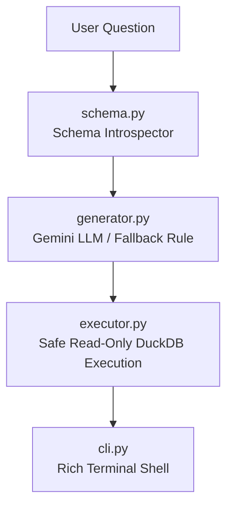

# 🤖 Text-to-SQL (T2S) Engine Directory (`text2sql/`)

This directory contains the **Text-to-SQL Natural Language Query Engine**, which translates English or Vietnamese user questions into validated DuckDB SQL queries and executes them safely.

---

## 🏗️ Architecture & Component Overview



### 🧱 Script Breakdown

| File | Primary Responsibility |
| :--- | :--- |
| **`schema.py`** | Inspects `duckdb_warehouse/warehouse.duckdb` and builds DDL context prompts for the LLM. |
| **`generator.py`** | Uses Google Gemini API (`google-genai`) or offline heuristic rules to generate SQL, then validates it with `sqlglot`. |
| **`executor.py`** | Executes SQL queries in DuckDB read-only mode, blocking destructive SQL statements. |
| **`cli.py`** | Interactive Rich terminal shell for querying the data warehouse. |

---

## 🛠️ How to Run

```bash
# Global shortcut from any folder:
text2sql "Top 5 products by revenue"
text2sql -i

# Using Makefile:
make text2sql
```
