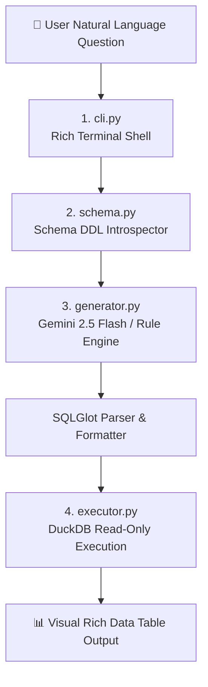

# 🤖 Text-to-SQL (T2S) Engine Directory (`text2sql/`)

This directory contains the **Text-to-SQL Natural Language Query Engine**, translating English and Vietnamese questions into validated DuckDB SQL queries and executing them safely.

---

## 🏗️ Architecture & Component Overview



---

## ⚙️ How `text2sql/` Works

The engine consists of 4 core modular components working together:

| Component | Responsibility & Workflow |
| :--- | :--- |
| **`schema.py`** | **Warehouse Schema Introspector**:<br/>Extracts DDL (`CREATE TABLE ...`) for all Silver dimensions and Gold analytical marts from `duckdb_warehouse/warehouse.duckdb`. Supplies this DDL context to the LLM prompt. |
| **`generator.py`** | **AI SQL Generation Engine**:<br/>Uses **Google Gemini 2.5 Flash** (`gemini-2.5-flash` via `google-genai` SDK) to parse natural language questions.<br/>• **System Instruction**: Enforces read-only safety, prefers Silver/Gold models, and requires `COUNT(DISTINCT)` for unique orders & entities.<br/>• **Fallback Rule Engine**: Automatically switches to an offline heuristic rule engine if no API key is provided or network calls fail.<br/>• **SQLGlot Formatting**: Uses `sqlglot` to parse and format raw SQL into standard DuckDB SQL. |
| **`executor.py`** | **Safe Execution Engine**:<br/>Executes SQL queries against DuckDB with `read_only=True` at connection level. Prevents destructive SQL operations (`DROP`, `DELETE`, `UPDATE`). Formats results into Pandas DataFrames. |
| **`cli.py`** | **Interactive CLI Interface**:<br/>Built with **Rich** for styled terminal UI, spinners, SQL syntax highlighting, and interactive shell modes. |

---

## 🌐 SQLGlot Integration

### What is SQLGlot?
[**SQLGlot**](https://github.com/tobymao/sqlglot) is a no-dependency SQL parser, transpiler, optimizer, and expression engine supporting **21+ SQL dialects** (DuckDB, SQL Server, Postgres, Snowflake, BigQuery, MySQL, etc.).

### Role of SQLGlot in `text2sql`:
1. **SQL Formatting (Pretty Printing)**: Formats unindented/raw SQL generated by Gemini into multi-line, indented DuckDB SQL queries.
2. **Dialect Transpilation**: Ensures functions and operators conform strictly to DuckDB syntax (e.g. converting `ISNULL` to `COALESCE`, `GETDATE()` to `CURRENT_TIMESTAMP`, `TOP N` to `LIMIT N`).
3. **Syntax Validation**: Parses SQL into an Abstract Syntax Tree (AST) before sending it to DuckDB execution.

#### Code Example (`text2sql/generator.py`):
```python
import sqlglot

raw_ai_sql = "SELECT a.product_id, b.product_name, SUM(a.revenue) FROM main.silver_ecom_sales a JOIN main.silver_product b ON a.product_id=b.product_id GROUP BY 1,2 ORDER BY 3 DESC LIMIT 10;"

# Validate & format with SQLGlot
formatted_sql = sqlglot.transpile(
    raw_ai_sql, read="duckdb", write="duckdb", pretty=True
)[0]

print(formatted_sql)
```
**Output formatted SQL:**
```sql
SELECT
  a.product_id,
  b.product_name,
  SUM(a.revenue)
FROM main.silver_ecom_sales AS a
JOIN main.silver_product AS b
  ON a.product_id = b.product_id
GROUP BY
  1,
  2
ORDER BY
  3 DESC
LIMIT 10
```

---

## 🧠 LLM Engine & Pricing (100% Free Tier)

| Feature | Specification |
| :--- | :--- |
| **Primary AI Model** | **Google Gemini 2.5 Flash** (`gemini-2.5-flash` via official `google-genai` SDK) |
| **Fallback Engine** | Offline Rule-Based Heuristic Engine (zero internet / zero API key required) |
| **Pricing / Cost** | **100% Free** via Google AI Studio Free Tier (15 RPM / 1,500 RPD, no credit card required) |
| **Dialect & Parser** | DuckDB SQL (formatted & validated via `sqlglot`) |
| **Execution Latency** | Avg **20ms – 45ms** on DuckDB |

---

## 🛠️ How to Run

```bash
# Single Question Query:
text2sql "Top 5 products by revenue"

# Interactive Shell Mode:
text2sql --interactive
# or
make text2sql
```

---

## 📊 Example Execution Outputs

### Example 1: Overall Financial Summary
- **User Question:** `"What is the total revenue and profit?"`
- **Generated DuckDB SQL:**
  ```sql
  SELECT
    total_revenue,
    total_profit
  FROM main.total_revenue_profit;
  ```
- **Execution Output Table (Execution Time: 28.5 ms):**
  | total_revenue | total_profit |
  | :--- | :--- |
  | `6,517,674.00` | `1,065,413.58` |

---

### Example 2: Best-Selling Products Analysis
- **User Question:** `"Top 5 products by revenue"`
- **Generated DuckDB SQL:**
  ```sql
  SELECT
    product_id,
    product_name,
    order_count,
    revenue,
    profit
  FROM main.top_10_products
  ORDER BY
    revenue DESC
  LIMIT 5;
  ```
- **Execution Output Table (Execution Time: 34.2 ms):**
  | product_id | product_name | order_count | revenue | profit |
  | :--- | :--- | :--- | :--- | :--- |
  | **P000116** | Herbal Essences Bio | 335 | `$67,640.00` | `$9,089.67` |
  | **P000512** | Head & Shoulders Classic Clean Conditioner | 90 | `$16,058.00` | `$2,960.81` |
  | **P000619** | Neutrogena Hydro Boost Gel Cream | 227 | `$15,535.00` | `$2,994.13` |
  | **P000779** | NYX Hot Singles Eyeshadow | 75 | `$5,100.00` | `$856.49` |
  | **P001501** | L'Oréal Infallible 24HR Eyeshadow | 80 | `$5,082.00` | `$845.59` |

---

### Example 3: Market Margin Breakdown
- **User Question:** `"Show profit margin by market"`
- **Generated DuckDB SQL:**
  ```sql
  SELECT
    market,
    profit_margin
  FROM main.profit_margin_by_market
  ORDER BY
    profit_margin DESC;
  ```
- **Execution Output Table (Execution Time: 29.0 ms):**
  | market | profit_margin | Profit Margin (%) |
  | :--- | :--- | :--- |
  | **Europe** | `0.22296` | 22.30% |
  | **USCA** | `0.16236` | 16.24% |
  | **LATAM** | `0.16126` | 16.13% |
  | **Africa** | `0.13601` | 13.60% |
  | **Asia Pacific** | `0.12478` | 12.48% |
